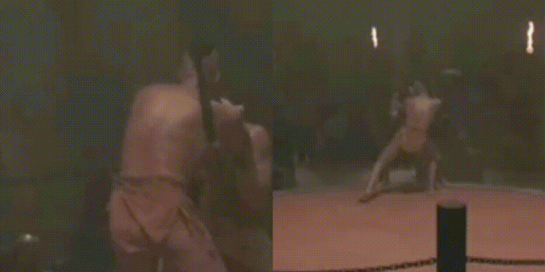
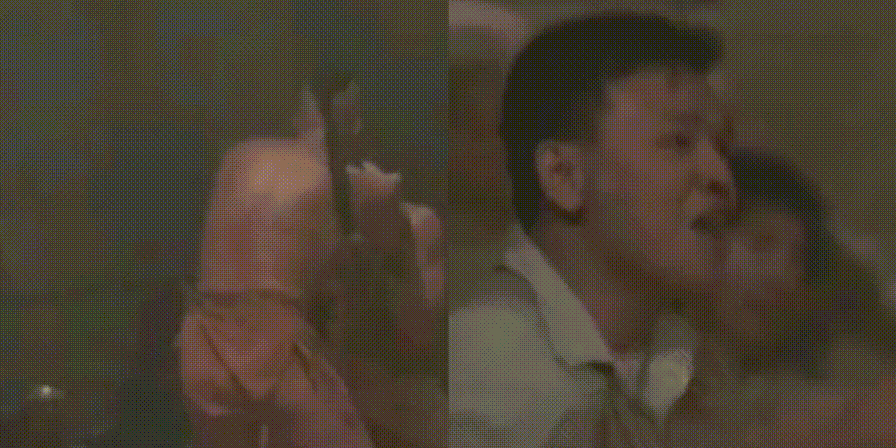

# RAte INvariance (RAIN) Layer Project Page

This project contains the code and results used for the rate invariance layer project. The main problem being tackled is the normalization of changes to temporal frequency of the input sections.

Our Goal: Submit ASAP

## Takeaways

## Table of Contents

* [Features to add to framework](#feattoadd)
* [Current Progress](#currentprogress)
* [Introduction](#intro)
* [Baseline Models](#baselinemodels)
* [RAIN Layers](#rainlayers)
    * [RAIN v6.0](#rainv6)
    * [RAIN v6.1](#rainv6.1)
    * [RAIN v21.0](#rainv21)
    * [RAIN v22.0](#rainv22)
    * [RAIN v23.0](#rainv23)
        * [RAIN v23.0 LSTM](#rainv23_lstm)
        * [RAIN v23.1](#rainv23.1)
            * [RAIN v23.1.1](#rainv23.1.1)
            * [RAIN v23.1.2](#rainv23.1.2)
        * [RAIN v23.2](#rainv23.2)
            * [RAIN v23.2.1](#rainv23.2.1)
                * [RAIN v23.2.1.1](#rainv23.2.1.1)
                * [RAIN v23.2.1.2](#rainv23.2.1.2)
            * [RAIN v23.2.2](#rainv23.2.2)
                * [RAIN v23.2.2.1](#rainv23.2.2.1)
        * [RAIN v23.3](#rainv23.3)
        * [RAIN v23.4](#rainv23.4)
        * [RAIN v23.5](#rainv23.5)
        * [RAIN v23.6](#rainv23.6)
    * [RAIN v24.0](#rainv24)
        * [RAIN v24.0 LSTM](#rainv24_lstm)
        * [RAIN v24.1](#rainv24.1)

    * [RAIN v25.0](#rainv25)
    * [RAIN v26.0](#rainv26)
    * [RAIN v27.0](#rainv27)
    * [RAIN v28.0](#rainv28)
    * [RAIN v29.0](#rainv29)
    * [RAIN v30.0](#rainv30)
    * [RAIN v31.0](#rainv31)
    * [RAIN v32.0](#rainv32)
    * [RAIN v33.0](#rainv33)
    * [RAIN v34.0](#rainv34)

* [Experiment 1 - Models trained using original datasets](#expt1)
* [Experiment 2 - Models trained using rate-modified datasets](#expt2)
* [Ideas for RAIN Layer](#ideas)

<a name="feattoadd"/>
## Features to add to Framework
* Extraction of only layer weights after training and save them as data dictionaries.
* Option to load from data dictionaries (trained models using the framework) or initialize models.
* Adding TF records to speed up pipeline and make it consistent.
* Confirm LRCN compatibility to TF records.
* Adding TSN model and confirm performance.
* Adding optical flow models and confirming their performance.

<a name="currentprogress"/>
## Current Progress

     EXPERIMENT 1: Trained using original datasets
| Experiments           |  Coding in Progress  | Executing |  Debug  | Complete  (HMDB51)| Complete  (UCF101)|    
|:---------------------:|:--------------------:|:---------:|:-------:|:-----------------:|:-----------------:|
| VGG16                 |         &#9745;      |  &#9745;  | &#9974; |     &#9974;       |     &#9974;       |
| ResNet-50             |         &#9745;      |  &#9745;  | &#9745; |     &#9745;       |     &#9974;       |
| ResNet-50 + RAINv21.0 |         &#9745;      |  &#9745;  | &#9745; |     &#9745;       |     &#9974;       |
| ResNet-50 + RAINv22.0 |         &#9745;      |  &#9745;  | &#9745; |     &#9745;       |     &#9974;       |
| ResNet-50 + RAINv23.0 |         &#9745;      |  &#9745;  | &#9745; |     &#9745;       |     &#9974;       |
| ResNet-50 + RAINv23.0 LSTM |    &#9745;      |  &#9745;  | &#9745; |     &#9745;       |     &#9974;       |
| ResNet-50 + RAINv23.1 |         &#9745;      |  &#9745;  | &#9745; |     &#9745;       |     &#9974;       |
| ResNet-50 + RAINv23.2 |         &#9745;      |  &#9745;  | &#9745; |     &#9745;       |     &#9974;       |
| ResNet-50 + RAINv23.3 |         &#9745;      |  &#9745;  | &#9745; |     &#9745;       |     &#9974;       |
| ResNet-50 + RAINv24.0 |         &#9745;      |  &#9745;  | &#9745; |     &#9745;       |     &#9974;       |
| ResNet-50 + RAINv24.0 LSTM |    &#9745;      |  &#9745;  | &#9745; |     &#9745;       |     &#9974;       |
| ResNet-50 + RAINv24.1 |         &#9745;      |  &#9745;  | &#9745; |     &#9745;       |     &#9974;       |
| ResNet-50 + RAINv25.0 |         &#9745;      |  &#9745;  | &#9745; |     &#9745;       |     &#9974;       |
| ResNet-50 + RAINv26.0 |         &#9745;      |  &#9745;  | &#9745; |     &#9745;       |     &#9974;       |
| ResNet-50 + RAINv27.0 |         &#9745;      |  &#9745;  | &#9745; |     &#9745;       |     &#9974;       |
| ResNet-50 + RAINv28.0 |         &#9745;      |  &#9745;  | &#9745; |     &#9745;       |     &#9974;       |
| ResNet-50 + RAINv29.0 |         &#9745;      |  &#9745;  | &#9745; |     &#9745;       |     &#9974;       |
| ResNet-50 + RAINv30.0 |         &#9745;      |  &#9745;  | &#9745; |     &#9745;       |     &#9974;       |

     EXPERIMENT 2: Trained using rate-modified datasets
| Experiments        |  Coding in Progress  | Executing |  Debug  | Complete (HMDB51) | Complete (UCF101) |
|:------------------:|:--------------------:|:---------:|:-------:|:-----------------:|:-----------------:|
| VGG16              |         &#9745;      |  &#9974;  | &#9974; |       &#9974;     |       &#9974;     |
| ResNet-50          |         &#9745;      |  &#9974;  | &#9974; |       &#9974;     |       &#9974;     |
| ResNet-50 + RAINv1 |         &#9745;      |  &#9974;  | &#9974; |       &#9974;     |       &#9974;     |
| ResNet-50 + RAINv2 |         &#9745;      |  &#9974;  | &#9974; |       &#9974;     |       &#9974;     |
| ResNet-50 + RAINv3 |         &#9745;      |  &#9974;  | &#9974; |       &#9974;     |       &#9974;     |

#### LEGEND
Complete   -  &#9745;
Incomplete -  &#9974;

<a name="intro"/>
## Introduction
**Problem**: Parameterzing temporal activity and extracting rate invariant features.

**Model**: end-to-end gradient based learning models (Neural Network), supervision using only action labels.

**Assumptions**

* Action: A set of body poses confined to a temporal order.
* Action Video: Single or multiple instances of an action within a video.
* Atmost, an action can take up the entire video (a complete single cycle over the entire set of datapoints).
* Frames per sec is consistent throughout all the videos in a dataset.
* Model revolves around the template formed by Spatial Transformer Networks(https://arxiv.org/abs/1506.02025).
* Assigning `soft` structure to extract necessary parameters, no intermediate or external supervision provided.

**Innovations**

* Differentiable, plug-n-play module which can be placed anywhere within a network where 1 independent dimension of the input is temporal.
* `Rate-normalized` outcome of the layer is fixed in size. Hence overcomes LSTM cell **memory issues** and allows **large videos to be applied to standard deep architectures in normal GPUs**.
* Custom layer definition for parameter extraction.
* Methodical demonstration of necessity to mathematically model rate-invariant characteristics in ANNs.

**Training data**: vanilla HMDB51 and UCF101 along with their rate modified verisons, with action labels.

**Testing data**: vanilla HMDB51 and UCF101 along with their rate modified versions.

**Applications**

* Improving action recognition, first person video etc.
* A plug-and-play layer to obtain normalized video representation.
* Application of the normalized representation to action segmentation, detection, etc.

<a name="baselinemodels"/>
## Baseline Models
* [ResNet50 + LSTM]:(https://github.com/fchollet/deep-learning-models/releases/download/v0.2/resnet50_weights_tf_dim_ordering_tf_kernels_notop.h5)
* [LRCN]           :()     
* [VGG16    + LSTM]:(https://github.com/fchollet/deep-learning-models/releases/download/v0.1/vgg16_weights_tf_dim_ordering_tf_kernels_notop.h5)

<a name="rainlayers"/>
## RAIN Layers
This section contains the implemented ideas for various versions of RAIN layers and their descriptions.  The versions begin at v21 because versions 1-20 used an different parameterization network that was deemed inferior to the current method.  The previous method incorporated the parameterization network directly into the model attempting to learn alpha and phi through multiple convolutional and fully connected layers before passing them into the extraction layer. Versions 21 and onward instead simply initialize variables alpha and phi and allow them to learn through backpropagation.  This new method causes a single alpha and phi value to be learned for every video.  This is addressed by incorporating an LSTM to process the input videos and learning alpha and phi from the hidden states of this LSTM. This LSTM formulation for the parameterization network will be implemented once various extraction layer versions have been tested and optimized. 

### RAIN Layers incorporating alpha and phi

<a name="rainv6"/>
#### RAIN Layer v6.0
---------------
Allow the output of the extract layer to be parameters used to modify the input video by gradually slowing down the video from the default rate to some learned rate until it reaches the main action and then speeding it back up to the default rate. The beginning and end points of this sampling will still be the beginning and end of the input video.

![RAINv6 Paramnw PLACEHOLDER] (/images/Paramnw.pdf)
![RAINv6 extractlayer PLACEHOLDER] (/images/extractlayer.pdf)

<a name="rainv6.1"/>
##### RAIN Layer v6.1
---------------
The original v6 model may have had a poor initialization for learning alpha and phi so they will both be reinitialized to sigmoid(1.0) and trained again.

![RAINv6.1 Paramnw PLACEHOLDER] (/images/Paramnw.pdf)
![RAINv6.1 extractlayer PLACEHOLDER] (/images/extractlayer.pdf)

<a name="rainv21"/>
#### RAIN Layer v21.0
---------------
The use of sampling and phase offset akin to 1D signals should be sufficient to characterize a given action signal. Initialize alpha and phi as variables and let them learn based solely off of backpropagation. Inputs to extraction layer come from the beginning of the model directly from the input videos.

![RAINv21 Paramnw PLACEHOLDER] (/images/Paramnw.pdf)
![RAINv21 extractlayer PLACEHOLDER] (/images/extractlayer.pdf)

<a name="rainv22"/>
#### RAIN Layer v22.0
---------------
Initialize alpha and phi as variables and let them learn based solely off of backpropagation. Inputs to extraction layer come from the end of the model, right before the models' LSTM.

![RAINv22 Paramnw PLACEHOLDER] (/images/Paramnw.pdf)
![RAINv22 extractlayer PLACEHOLDER] (/images/extractlayer.pdf)

<a name="rainv27"/>
#### RAIN Layer v27.0
---------------
The idea behind this model is to attempt to decouple phi and alpha. First phi is applied to the input videos which will select an offset and then select the remaining frames from this location to the end of the video.  Then alpha is applied which will sample 50 frames starting at the location that phi selected. The values are initialized at the beginning of the model along with the extraction layer location.

![RAINv27 Paramnw PLACEHOLDER] (/images/Paramnw.pdf)
![RAINv27 extractlayer PLACEHOLDER] (/images/extractlayer.pdf)

<a name="rainv28"/>
#### RAIN Layer v28.0
---------------
This model is nearly identical to v27.0 except that the alpha and phi initializations and the extraction layer are located towards the end of the model, like in v22.0.

![RAINv28 Paramnw PLACEHOLDER] (/images/Paramnw.pdf)
![RAINv28 extractlayer PLACEHOLDER] (/images/extractlayer.pdf)

<a name="rainv29"/>
#### RAIN Layer v29.0
---------------
Results show that phi and alpha may learn better if they are initialized and applied on the top or bottom of the network. However, this ideal location may not be the same for both alpha and phi.  This model initalizes and applies the sampling parameter, alpha, at the top of the model directly to the input videos.  The output of this first extraction layer will be a video beginning at the first frame of the input and consist of 100 frames sampled and interpolated to whatever end frame that alpha learns. This output video gets passed through the network until just before the LSTM where the offset parameter, phi, is applied.  Phi will select one of the 100 input features as a starting point and uniformly sample and interpolate 50 features to the end of the inputs tensor. 

![RAINv29 Paramnw PLACEHOLDER] (/images/Paramnw.pdf)
![RAINv29 extractlayer PLACEHOLDER] (/images/extractlayer.pdf)

<a name="rainv30"/>
#### RAIN Layer v30.0
---------------
This model is similar to v29 except that phi is applied to the input videos and alpha is applied to the features at the end of the model.

![RAINv30 Paramnw PLACEHOLDER] (/images/Paramnw.pdf)
![RAINv30 extractlayer PLACEHOLDER] (/images/extractlayer.pdf)

<a name="rainv32"/>
#### RAIN Layer v32.0
---------------
The idea is to use frequency modulation exactly like v6 except that it will be applied to the features at the bottom of the model.

![RAINv32 Paramnw PLACEHOLDER] (/images/Paramnw.pdf)
![RAINv32 extractlayer PLACEHOLDER] (/images/extractlayer.pdf)

<a name="rainv33"/>
#### RAIN Layer v33.0
---------------
This formulation is similar to the other FM model except that alpha and phi dictate the location and rate of the input video that gets slowed down.  The output dimension of this slowed down section is L/2, where the other L/2 frames are the remaining beginning and end of the input video uniformly sampled.

![RAINv33 Paramnw PLACEHOLDER] (/images/Paramnw.pdf)
![RAINv33 extractlayer PLACEHOLDER] (/images/extractlayer.pdf)

### RAIN Layers incorporating alpha only

<a name="rainv23"/>
#### RAIN Layer v23.0
---------------
Initialize alpha as a variable and let it learn based solely off of backpropagation. Inputs to extraction layer come from the beginning of the model, similar to v21. We are using only alpha in order to understand if uniform sampling over the entire sequence is important. If retaining some information about the entire setup is necessary then why not remove the offset parameter and instead attempt to interpolate using sampling parameter only. In case the sampling parameter minimizes to uniform sampling then we have a strong case to retain it.

![RAINv23 Paramnw PLACEHOLDER] (/images/Paramnw.pdf)
![RAINv23 extractlayer PLACEHOLDER] (/images/extractlayer.pdf)

<a name="rainv23_lstm"/>
#### RAIN Layer v23.0 LSTM
---------------
Instead of just initialiizing a value to alpha and letting it learn based off of backpropagation, we want the value of alpha to differ from video to video so we initialize it based off of the hidden state of an LSTM unrolled 4 times. The extraction layer and location of this parameterization LSTM is identical to v23.0.

![RAINv23 LSTM Paramnw PLACEHOLDER] (/images/Paramnw.pdf)
![RAINv23 LSTM extractlayer PLACEHOLDER] (/images/extractlayer.pdf)

<a name="rainv23.1"/>
#### RAIN Layer v23.1
---------------
For the previous models, the value of alpha can be any real value, then an ReLu activation function was applied to set all negative values to zero and a negative exponential function was applied to force the values of alpha after these functions to be between 0 and 1.  In this model we try to switch the activation function to tanh because instead of negative alpha values defaulting alpha after the activations to 1.0, this activation function will allow negative values to remain valid

![RAINv23.1 Paramnw PLACEHOLDER] (/images/Paramnw.pdf)
![RAINv23.1 extractlayer PLACEHOLDER] (/images/extractlayer.pdf)

<a name="rainv23.1.1"/>
##### RAIN Layer v23.1.1
---------------
We pass alpha through an ReLu activation before passing it through the tanh. Reducing the parameter space that alpha has to choose from could allow it to learn a value other than 0 or 1 more easily.

![RAINv23.1.1 Paramnw PLACEHOLDER] (/images/Paramnw.pdf)
![RAINv23.1.1 extractlayer PLACEHOLDER] (/images/extractlayer.pdf)

<a name="rainv23.1.2"/>
##### RAIN Layer v23.1.2
---------------
We pass alpha through a negative ReLu activation before passing it through the tanh. v23.1.1 forces alpha to have values from 0.5 to 1.0, this method will allow alpha to have values from 0.0 to 0.5 to see if it still results in alpha=0.5.

![RAINv23.1.2 Paramnw PLACEHOLDER] (/images/Paramnw.pdf)
![RAINv23.1.2 extractlayer PLACEHOLDER] (/images/extractlayer.pdf)

<a name="rainv23.2"/>
#### RAIN Layer v23.2
---------------
Similarly to 23.1, we change the activation function to sigmoid instead of tanh.

![RAINv23.2 Paramnw PLACEHOLDER] (/images/Paramnw.pdf)
![RAINv23.2 extractlayer PLACEHOLDER] (/images/extractlayer.pdf)

<a name="rainv23.2.1"/>
##### RAIN Layer v23.2.1
---------------
We pass alpha through an ReLu activation before passing it through the sigmoid. Reducing the parameter space that alpha has to choose from could allow it to learn a value other than 0 or 1 more easily.

![RAINv23.2.1 Paramnw PLACEHOLDER] (/images/Paramnw.pdf)
![RAINv23.2.1 extractlayer PLACEHOLDER] (/images/extractlayer.pdf)

<a name="rainv23.2.1.1"/>
###### RAIN Layer v23.2.1.1
---------------
We set alpha to be a constant 0.73. Since the best performance is reached when alpha is held constant for the majority of training, this model will determine the impact of learning different initializations of the constant alpha.

![RAINv23.2.1.1 Paramnw PLACEHOLDER] (/images/Paramnw.pdf)
![RAINv23.2.1.1 extractlayer PLACEHOLDER] (/images/extractlayer.pdf)

<a name="rainv23.2.1.2"/>
###### RAIN Layer v23.2.1.2
---------------
We set alpha to be a constant 0.5. Since the best performance is reached when alpha is held constant for the majority of training, this model will determine the impact of learning different initializations of the constant alpha.

![RAINv23.2.1.2 Paramnw PLACEHOLDER] (/images/Paramnw.pdf)
![RAINv23.2.1.2 extractlayer PLACEHOLDER] (/images/extractlayer.pdf)

<a name="rainv23.2.2"/>
##### RAIN Layer v23.2.2
---------------
We pass alpha through a negative ReLu activation before passing it through the sigmoid. v23.2.1 forces alpha to have values from 0.5 to 1.0, this method will allow alpha to have values from 0.0 to 0.5 to see if it still results in alpha=0.5.

![RAINv23.2.2 Paramnw PLACEHOLDER] (/images/Paramnw.pdf)
![RAINv23.2.2 extractlayer PLACEHOLDER] (/images/extractlayer.pdf)

<a name="rainv23.2.2.1"/>
###### RAIN Layer v23.2.2.1
---------------
We set alpha to be a constant 0.27. Since the best performance is reached when alpha is held constant for the majority of training, this model will determine the impact of learning different initializations of the constant alpha.

![RAINv23.2.2.1 Paramnw PLACEHOLDER] (/images/Paramnw.pdf)
![RAINv23.2.2.1 extractlayer PLACEHOLDER] (/images/extractlayer.pdf)

<a name="rainv23.3"/>
#### RAIN Layer v23.3
---------------
The default value of alpha is set so that alpha after the activation functions equals 0.5 because it is equidistant from both 0.0 and 1.0. A problem with the other versions was that the value alpha was learning was 1.0 after the activation functions so if we initialize it lower to 0.25 instead of 0.5 then it may not end up learning the value 1.0.

![RAINv23.3 Paramnw PLACEHOLDER] (/images/Paramnw.pdf)
![RAINv23.3 extractlayer PLACEHOLDER] (/images/extractlayer.pdf)

<a name="rainv23.4"/>
#### RAIN Layer v23.4
---------------
Determine the impace of raising the initialization of alpha.

![RAINv23.4 Paramnw PLACEHOLDER] (/images/Paramnw.pdf)
![RAINv23.4 extractlayer PLACEHOLDER] (/images/extractlayer.pdf)

<a name="rainv23.5"/>
#### RAIN Layer v23.5
---------------
Determine the impace of lowering the initialization of alpha.

![RAINv23.5 Paramnw PLACEHOLDER] (/images/Paramnw.pdf)
![RAINv23.5 extractlayer PLACEHOLDER] (/images/extractlayer.pdf)

<a name="rainv23.6"/>
#### RAIN Layer v23.6
---------------
The exponential activation used in v23 allows for a more gradual transition from zero to one than tanh or sigmoid, however using relu limits the values learned by the parameterization network to be poisitive otherwise all negative values get defaulted to alpha=1.0. Using another exponential function for negative values allows them to result in alpha values between zero and one as well.

![RAINv23.6 Paramnw PLACEHOLDER] (/images/Paramnw.pdf)
![RAINv23.6 extractlayer PLACEHOLDER] (/images/extractlayer.pdf)

<a name="rainv24"/>
#### RAIN Layer v24.0
---------------
Initialize alpha as a variable and let it learn based solely off of backpropagation. This model only uses alpha and is similar to v23.0 except that alpha and the extraction layer are applied towards the end of the model similar to v22.0.

![RAINv24 Paramnw PLACEHOLDER] (/images/Paramnw.pdf)
![RAINv24 extractlayer PLACEHOLDER] (/images/extractlayer.pdf)

<a name="rainv24_lstm"/>
#### RAIN Layer v24.0 LSTM
---------------
This model calculates values for alpha using an lstm similar to v23.0_LSTM but applied to the network towards the bottom idential to v24.0.

![RAINv24 LSTM Paramnw PLACEHOLDER] (/images/Paramnw.pdf)
![RAINv24 LSTM extractlayer PLACEHOLDER] (/images/extractlayer.pdf)

<a name="rainv24.1"/>
#### RAIN Layer v24.1
---------------
This model is idential to v24.0 except that the initialization for alpha is set to 0.25 like in v23.3

![RAINv24.1 Paramnw PLACEHOLDER] (/images/Paramnw.pdf)
![RAINv24.1 extractlayer PLACEHOLDER] (/images/extractlayer.pdf)

### RAIN Layers incorporating phi only

<a name="rainv25"/>
#### RAIN Layer v25.0
---------------
Similarly to V23.0, the idea behind this version to remove the sampling parameter and retain the offset parameter. The sampling will be uniform. This will show the impact that splicing the input video based off of the offset parameter.

![RAINv25 Paramnw PLACEHOLDER] (/images/Paramnw.pdf)
![RAINv25 extractlayer PLACEHOLDER] (/images/extractlayer.pdf)

<a name="rainv26"/>
#### RAIN Layer v26.0
---------------
Initialize phi as a variable and let it learn based solely off of backpropagation. This model is similar to v25 except that phi and the extraction layer are located at the bottom of the model like in v22.0.

![RAINv26 Paramnw PLACEHOLDER] (/images/Paramnw.pdf)
![RAINv26 extractlayer PLACEHOLDER] (/images/extractlayer.pdf)

<a name="rainv31"/>
#### RAIN Layer v31.0
---------------
Initialize phi at the beginning of the model and then extract the next L (50) frames starting at phi. Phi is a variable with a negative exponential activation function.

![RAINv31 Paramnw PLACEHOLDER] (/images/Paramnw.pdf)
![RAINv31 extractlayer PLACEHOLDER] (/images/extractlayer.pdf)

<a name="rainv34"/>
#### RAIN Layer v34.0
---------------
Initialize phi at the end of the model and then extract the next L (50) frames starting at phi. Phi is a variable with a negative exponential activation function.

![RAINv34 Paramnw PLACEHOLDER] (/images/Paramnw.pdf)
![RAINv34 extractlayer PLACEHOLDER] (/images/extractlayer.pdf)

<a name="expt1"/>
Experiment 1:  Models trained using original datasets
========================================================
The first experiment lists the results of models trained using only the original datasets.

<a name="paramsexpt1"/>
Parameters
----------
1. HMDB51 (For ResNet50 + LSTM and VGG16 + LSTM)
    * lr - 0.001   
    * momentum - 0.9   
    * wd - 0.001     
    * inputDims - 50 (250 for RAIN layers)
    * seqLength - 50    
    * outputDims - 51      
    * numVids - 3570    
    * size - 224        
    * nEpochs - 30    
    * saveFreq - 1      
    * valFreq - 3    
    * split - 1              
    * preprocessing:   
        * reduce framerate from 30 to 25 fps
        * resize to 256
        * random crop to 224
        * random flip
        * mean subtraction (R - 123.68, G - 116.778, B - 103.94)
        * extract 125 frame (loop if necessary) using offset
        * sample 25 from those 125
        * pad with 25 frames of zero

2. UCF 101 (For ResNet50 + LSTM and VGG16 + LSTM)
    * lr - 0.001   
    * momentum - 0.9   
    * wd - 0.001     
    * inputDims - 50     
    * seqLength - 50    
    * outputDims - 101      
    * numVids - 9537    
    * size - 224        
    * nEpochs - 30    
    * saveFreq - 1      
    * valFreq - 3    
    * split - 1              
    * preprocessing:   
        * resize to 256
        * random crop to 224
        * random flip
        * mean subtraction (R - 123.68, G - 116.778, B - 103.94)
        * extract 125 frame (loop if necessary) using offset
        * sample 25 from those 125
        * pad with 25 frames of zero

<a name="progressexpt1"/>
Progress
--------
    HMDB51 Baseline Experiments
|       Experiments        | Mean Recog. Accuracy(MRA) on Orig.  | Mean Recog. Accuracy(MRA) on Rate Modified  |
|:------------------------:|:----------------------------------: |:------------------------------------------: |
|   VGG16 + LSTM           |              --.--%                 |                  --.--%                     |
| ResNet50 + LSTM          |              43.01%                 |                  41.33%                     |

    HMDB51 Original RAIN Layer Experiments
|    Alpha and Phi Experiments        |      Extract Layer MRA        |    Alpha Value   |    Phi Value   |     Rate Modified Dataset MRA     |
|:-----------------------------------:|:----------------------------: |:---------------: |:-------------: |:--------------------------------: |
| ResNet50 + RAINv6 + LSTM            |              38.10%           |        0.31      |      0.51      |                --.--%             |
| ResNet50 + RAINv6.1 + LSTM          |              39.87%           |        0.73      |      0.69      |                --.--%             |
| ResNet50 + RAINv21 + LSTM           |            **43.14**%         |        1.0       |      0.11      |                --.--%             |                
| ResNet50 + RAINv22 + LSTM           |            **43.33**%         |        0.94      |      1.0       |                --.--%             |                
| ResNet50 + RAINv27 + LSTM           |              37.32%           |        0.043     |      1.0       |                --.--%             |                
| ResNet50 + RAINv28 + LSTM           |            **43.35**%         |        1.0       |      1.0       |                --.--%             |
| ResNet50 + RAINv29 + LSTM           |              42.61%           |        1.0       |      0.66      |                --.--%             |
| ResNet50 + RAINv30 + LSTM           |              42.75%           |        1.0       |      1.0       |                --.--%             |
| ResNet50 + RAINv32 + LSTM           |              37.84%           |        0.27      |      0.47      |                --.--%             |
| ResNet50 + RAINv33 + LSTM           |              36.34%           |        0.5       |      0.5       |                --.--%             |
| | | | |
|    Alpha Only Experiments           |      Extract Layer MRA        |    Alpha Value   |    Phi Value   |     Rate Modified Dataset MRA     |    
| ResNet50 + RAINv23 + LSTM           |             **44.64**%        |        0.46      |      N/A       |            **42.78**%             |   
| ResNet50 + RAINv23.1 + LSTM         |               42.16%          |        0.32      |      N/A       |              --.--%               |  
| ResNet50 + RAINv23.1.1 + LSTM       |             **44.05**%        |        0.50      |      N/A       |            **43.38**%             |  
| ResNet50 + RAINv23.1.2 + LSTM       |             **44.38**%        |        0.50      |      N/A       |              41.65%               | 
| ResNet50 + RAINv23.2 + LSTM         |             **43.46**%        |        0.51      |      N/A       |            **42.24**%             |  
| ResNet50 + RAINv23.2.1 + LSTM       |             **46.01**%        |        0.50      |      N/A       |            **44.41**%             |   
| ResNet50 + RAINv23.2.1.1 + LSTM     |             **43.92**%        |    C   0.73      |      N/A       |              --.--%               |   
| ResNet50 + RAINv23.2.1.2 + LSTM     |               43.01%          |    C   0.5       |      N/A       |              --.--%               |   
| ResNet50 + RAINv23.2.2 + LSTM       |               42.03%          |        0.25      |      N/A       |              --.--%               | 
| ResNet50 + RAINv23.2.2.1 + LSTM     |               41.24%          |    C   0.27      |      N/A       |              --.--%               |   
| ResNet50 + RAINv23.3 + LSTM         |             **44.51**%        |        1.0       |      N/A       |            **43.87**%             |   
| ResNet50 + RAINv23.4 + LSTM         |             **45.62**%        |        1.0       |      N/A       |            **44.29**%             |   
| ResNet50 + RAINv23.5 + LSTM         |               43.07%          |        0.33      |      N/A       |              --.--%               |   
| ResNet50 + RAINv23.6 + LSTM         |               41.96%          |        0.31      |      N/A       |              --.--%               |  
| ResNet50 + RAINv23.7.1 + LSTM       |             **44.77**%        |        0.83      |      N/A       |              --.--%               |
| ResNet50 + RAINv23.7.2 + LSTM       |               42.61%          |        0.39      |      N/A       |              --.--%               |
| ResNet50 + RAINv23.8.1 + LSTM       |               42.47%          |        0.70      |      N/A       |              --.--%               |
| ResNet50 + RAINv23.8.2 + LSTM       |               42.71%          |        0.23      |      N/A       |              --.--%               |
| ResNet50 + RAINv24 + LSTM           |               41.96%          |        1.0       |      N/A       |              --.--%               |   
| ResNet50 + RAINv24.1 + LSTM         |             **43.59**%        |        1.0       |      N/A       |            **42.63**%             |   
| | | | |
|    Phi Only Experiments             |      Extract Layer MRA        |    Alpha Value   |   Phi Value    |     Rate Modified Dataset MRA     |    
| ResNet50 + RAINv25 + LSTM           |               41.11%          |        N/A       |      1.0       |              --.--%               |
| ResNet50 + RAINv26 + LSTM           |             **43.76**%        |        N/A       |      0.61      |              --.--%               |
| ResNet50 + RAINv31 + LSTM           |             **43.53**%        |        N/A       |      1.0       |            **42.32**%             |
| ResNet50 + RAINv34 + LSTM           |             **43.43**%        |        N/A       |      1.0       |              --.--%               |
*-models denoted with a star were not trained to completion due to having already learned either one or zero for phi and alpha.

    UCF101 Experiments
|       Experiments        | Mean Recog. Accuracy(MRA) on Orig.  | Mean Recog. Accuracy(MRA) on Rate Modified  |
|:------------------------:|:----------------------------------: |:------------------------------------------: |
|   VGG16 + LSTM           |              --.--%                 |                  --.--%                     |
| ResNet50 + LSTM          |              --.--%                 |                  --.--%                     |

    UCF101 Original RAIN Layer Experiments
|       Experiments        | Median of Extract Layer MRA  | Mean of Extract Layer MRA  | Max of Extract Layer MRA  |
|:------------------------:|:---------------------------: |:-------------------------: |:------------------------: |
| ResNet50 + RAINv1 + LSTM |             --.--%           |             --.--%         |          --.--%           |
| ResNet50 + RAINv2 + LSTM |             --.--%           |             --.--%         |          --.--%           |
| ResNet50 + RAINv3 + LSTM |             --.--%           |             --.--%         |          --.--%           |

### Experiment 1 NOTES:

#### RAIN v21

Output: phi = 0.1104, alpha = 1.0 (-0.0303)

The left gif is the input video, the right gif is the output of RAINv21.

#### RAIN v22

Output: phi = 1.0 (-0.00795), alpha = 0.9395

Phi = 1.0 states that the output video will begin at frame N-L, then alpha will uniformly sample to frame (N-L)*0.9395

The left gif is the input video, the right gif is the output of RAINv22.

#### RAIN v23

Output: alpha ~ 0.462

Sample only the first 46% of the input video.

The left gif is the input video, the right gif is the output of RAINv23.

#### RAIN v23 LSTM

Median Output: alpha = 1.0 (before negative exponent alpha = 0.0)

Uniform sampling of input, alpha could have different values for various input videos but it is always 1.0.

#### RAIN v23.1

Output: alpha = 1.0 (-0.0803)

#### RAIN v23.3

Output: alpha = 1.0 (-0.0491)  

The output video is a uniformly sampled version of the entire input video.

#### RAIN v23.2

Output: alpha ~ 0.5136

The output video is sampled from every 2.5 frames of the original input. This means that videos upto the 125th frame are contained in the output. The output indices are [0, 2.5, 5.0, ..., 125].

#### RAIN v24

Output: alpha = 1.0 (-0.0280)

Uniform sampling of input

#### RAIN v24 LSTM

Output: alpha = 1.0 (before negative exponent alpha = 0.0)

Uniform sampling of input, alpha could have different values for various input videos but it is always 1.0.

#### RAIN v24.1

Output: alpha = 1.0 (-0.0164)

Output video is uniform sampling of 100 frames into 50 which means every alternate frame is picked up in the final outcome.

#### RAIN v25

Output: phi = 1.0 (-0.0272)

Output video is the last 50 frames of the input video.

#### RAIN v26

Output: phi ~ 0.6075

Phi ~ 0.6 means that phi has chosen the frame located 40% of the way from frame 0 to frame N-L. The output video then starts at this frame and uniformly samples L (50) frames until the end of the video (frame N)

The left gif is the input video, the right gif is the output of RAINv26.

#### RAIN v27

Output: phi = 1.0 (-0.104), alpha = 0.0426

Phi selects that the output video starts at frame N-L, but alpha is low enough for it to choose approximately 2.1 (50 * 0.0426) frames starting at frame N-L, then interpolates these 2.1 frames to 50.

The left gif is the input video, the right gif is the output of RAINv27.

#### RAIN v28

Output: phi = 1.0 (-0.0132), alpha = 1.0 (-0.00335)

The output video consists of the last 50 frames of the input video.

#### RAIN v29

Output: phi = 0.655, alpha = 1.0 (-0.0917)

Phi ~ 0.6 means that phi has chosen the frame located about 40% of the way from frame 0 to frame N-L. The output video then starts at this frame and uniformly samples L (50) frames until the end of the video (frame N) because alpha = 1.0.

#### RAIN v30

Output: phi = 1.0 (-0.0187), alpha = By default 1.0

Phi =1.0 means that phi has chosen the (N-L)th frame with alpha uniformly sampling from thereon in. Thus, the last 50 frames from the input 100 frames are taken as the input to the classification network.

<a name="expt2"/>
Experiment 2:  Models trained using rate-modified datasets
========================================================
The second experiment lists the results of models trained using only the rate-modified datasets.

<a name="paramsexpt2"/>
Parameters
----------
1. HMDB51 (For ResNet50 + LSTM and VGG16 + LSTM)
    * lr - 0.001  
    * momentum - 0.9
    * wd - 0.001  
    * inputDims - 50    
    * seqLength - 50
    * outputDims - 51  
    * numVids - 35700
    * size - 224        
    * nEpochs - 5
    * saveFreq - 1  
    * valFreq - 3
    * split - 1     
    * preprocessing:   
        * reduce framerate from 30 to 25 fps
        * resize to 256
        * random crop to 224
        * random flip, mean subtraction (R - 123.68, G - 116.778, B - 103.94)
        * extract 125 frame (loop if necessary) using offset
        * sample 25 from those 125
        * pad with 25 frames of zero

2. UCF 101 (For ResNet50 + LSTM and VGG16 + LSTM)
    * lr - 0.001   
    * momentum - 0.9  
    * wd - 0.001  
    * inputDims - 50     
    * seqLength - 50    
    * outputDims - 101
    * numVids - 95370
    * size - 224    
    * nEpochs - 1
    * saveFreq - 1
    * valFreq - 3
    * split - 1
    * preprocessing:   
        * resize to 256
        * random crop to 224
        * random flip
        * mean subtraction (R - 123.68, G - 116.778, B - 103.94),  
        * extract 125 frame (loop if necessary) using offset
        * sample 25 from those 125
        * pad with 25 frames of zero

<a name="progressexpt2"/>
Progress
--------
    HMDB51 Experiments
|       Experiments        | Mean Recog. Accuracy(MRA) on Orig.  | Mean Recog. Accuracy(MRA) on Rate Modified  |
|:------------------------:|:----------------------------------: |:------------------------------------------: |
|   VGG16 + LSTM           |              --.--%                 |                  --.--%                     |
| ResNet50 + LSTM          |              --.--%                 |                  --.--%                     |
| ResNet50 + RAINv1 + LSTM |              --.--%                 |                  --.--%                     |

    UCF101 Experiments
|       Experiments        | Mean Recog. Accuracy(MRA) on Orig.  | Mean Recog. Accuracy(MRA) on Rate Modified  |
|:------------------------:|:----------------------------------: |:------------------------------------------: |
|   VGG16 + LSTM           |              --.--%                 |                  --.--%                     |
| ResNet50 + LSTM          |              --.--%                 |                  --.--%                     |
| ResNet50 + RAINv1 + LSTM |              --.--%                 |                  --.--%                     |

![Ex1:baselineSpeedup] (/images/resnet_UCF101Rate_vid23002_input.gif/)

### NOTES:

<a name="ideas"/>
Ideas for Future Versions of RAIN Layer
===================
* V1:
    * Current implementation using offset and sampling parameters
    * Mean of Extract Layer
    * Median of Extract Layer
    * Max of Extract Layer
* V2:
    * Idea: (alpha only) The immediate next idea we were thinking about was to understand if uniform sampling over the entire sequence is important. If retaining some information about the entire setup is necessary then why not remove the offset parameter and instead attempt to interpolate using sampling parameter only. In case the sampling parameter minimizes to uniform sampling then we have a strong case to retain it.
    * Mean of Extract Layer
    * Median of Extract Layer
    * Max of Extract Layer
* V3:
    * Idea: (phi only) Similarly to V2, the idea behind this version to remove the sampling parameter and retain the offset parameter. The sampling will be uniform. This will show the impact that splicing the input video based off of the offset parameter.
    * Mean of Extract Layer
    * Median of Extract Layer
    * Max of Extract Layer
* V4:
    * Idea: (direct indices) Another idea proposed was to extract indices directly from the parameterization network and use them to interpolate output of extract layer. An interesting case would be the ordering proposed by such a system, or rather the lack of ordering so to speak. Are we getting close to segmentation territory possibly ?
    * Non-Sorted output of Extract Layer
    * Sorted output of Extract Layer
* V5:
    * Idea: (phi start, phi end) Replace the sampling parameter with a second offset parameter indicating the end frame of the sampling region. L frames will then be uniformly sampled between the start offset parameter and end offset parameter.
    * Mean of Extract Layer
    * Median of Extract Layer
    * Max of Extract Layer
* V6:
    * Idea: (nonlinear rate transform) Allow the output of the extract layer to be parameters used to modify the input video by gradually slowing down the video from the default rate to some learned rate until it reaches the main action and then speeding it back up to the default rate. The beginning and end points of this sampling will still be the beginning and end of the input video.
    * Variables learned directly

* V6.1:
    * Idea: (v6, alpha intiialized to sigmoid(1.0) phi initialized to sigmoid(1.0)) The original v6 model may have had a poor initialization for learning alpha and phi so they will both be reinitialized to sigmoid(1.0) and trained again.
    * Variables learned directly
    
* V7:
    * Idea: (Increase L) When comparing the inputs to the baseline networks, we found that multiple quick cycles are provided as input to the baseline networks. Given this high amount of redundancy, a possible solution to our situation of capturing only a single cycle would be to increase L so that the network has a longer timeframe to look over and make a decision.
    * Mean of Extract Layer
    * Median of Extract Layer
    * Max of Extract Layer
* V8:
    * Idea: (Change activation of FC2 to ReLu) While observing the outcomes of V1 we found that the videos have a general tendency to get slowed down but rarely speed up. This enforces a scenario where the rates of RAIN output videos are not the same. This could possibly be due to shackling of alpha by sigmoid activation (although this still allows for a theoretic speed up). Instead we believe ReLu might be a possible solution to this issue.
    * Mean of Extract Layer
    * Median of Extract Layer
    * Max of Extract Layer
* V9:
    * Idea: (V7 + V8) The previous versions seeks to study the individual impacts of each suggested change while this version seeks to combine them.
    * Mean of Extract Layer
    * Median of Extract Layer
    * Max of Extract Layer
* V10:
    * Idea: (V2 + phi after sampling) Based off of v2 results, we found that it is benenficial to allow alpha to sample from the entire video. Only afterwards will we apply the offset to the clip that was sampled by alpha. We will then resample that output to the correct number of frames, L.
    * Mean of Extract Layer
    * Median of Extract Layer
    * Max of Extract Layer

* V11:
    * Idea: (V3 + ReLu) Seeing that v3 fluctuates the learned value of phi from zero to one, it may be possible to apply a relu activation to fc2 instead of the sigmoid which can bias the values to zero or one.
    * Median of Extract Layer

* V12:
    * Idea: (V3 + random initializations) Currently the convolutional layers in the parameterization network are initialized to pretrained resnet weights, this may be what causes the network to bias the values of 0 and 1 for phi.
    * Median of Extract Layer

* V12.1:
    * Idea: (V12 + ReLu after Conv1 in Parameterization Network) Add an ReLu activation after Conv1 in the parameterization network.
    * Median of Extract Layer

* V13:
    * Idea: (V3 + LSTM) The network may not be able to learn the temporal information of the input properly in its current state which could be improved upon with an LSTM.
    * Median of Extract Layer

* V14:
    * Idea: (Alternate V1) The v1 definition of the RAIN layer causes the output video to return the first frame of the input if alpha equals zero no matter the value of phi. This model avoid this issue by first calculating alpha and then adding the offset. 
    * Median of Extract Layer

* V14.1:
    * Idea: (V14 without ReLu after Conv1 in Parameteriazation Network) Remove the ReLu after Conv1 to compare with v14.0 to determine the impact of the ReLu.
    * Median of Extract Layer

* V14.2:
    * Idea: (V14.1 with random initializations) Remove the parameterization network initializations to determine their impact.
    * Median of Extract Layer

* V14.3:
    * Idea: (V14.2 with FC1 linear activation) Remove the activation function on FC1 to determine its impact.
    * Median of Extract Layer
    
* V15:
    * Idea: (V14 ReLu activation for phi, sigmoid activation for alpha, random initializations) The value phi has a linear relationship with the chosen output indices while alphas relationship is nonlinear. Thus FC2 is split into FC2a for alpha with a sigmoid activation function and FC2b for phi with an ReLu activation function.
    * Median of Extract Layer
     
* V16:
    * Idea: (Add FC3 layer with V dims)  This model attempts to fix the issue that could arrise from combining dimension K and V immediately after the convolution layers by first passing dimension K through FC1 then reshaping the output and passing dimension V through FC2 before reducing the output to 2 dimensions in FC3.
    * Median of Extract Layer
     
* V17:
    * Idea: (Pass K dims through FC1 then reshape to V dims through FC2) The filter blocks relating to each pixel may contain the information needed to learn alpha and phi.  Allow output of FC2 to be the filter dimension, V, x 2. 
    * Median of Extract Layer
     
* V18:
    * Idea: (Parameterization Network at the end, phi and alpha) Since the parameterization network has been located at the top of the model, the gradients may have had less of an impact by the time they reached the parameterization network, resulting in alpha and phi just falling to 0.0 or 1.0.  Moving the parameterization network to the end could allow the gradients to have a greater impact on alpha and phi values. 
    * Mean of Extract Layer
    * Median of Extract Layer
 
* V19:
    * Idea: (V18 + negative exponent) The tanh used in v18 to force the values of alpha and phi may have been to abrupt causing them to fall to 0.0 or 1.0.  A negative exponent has a more gradual curve which could allow alpha and phi to learn values in between 0 and 1.
    * Median of Extract Layer

* V20:
    * Idea: (V18 phi only, take max of block softmax) Instead of allowing phi to be any frames, only allow it to choose from the J blocks.  
    * Max of Extract Layer

* V21:
    * Idea: (alpha and phi as variables, based off of v14) Initialize alpha and phi as variables and let them learn based solely off of backpropagation. Inputs to extraction layer come from the beginning of the model, similar to v14.
    * Variables learned directly

* V22:
    * Idea: (alpha and phi as variables, based off of v18) Initialize alpha and phi as variables and let them learn based solely off of backpropagation. Inputs to extraction layer come from the end of the model, similar to v18.
    * Variables learned directly

* V23:
    * Idea: (alpha as a variable, based off of v2 + v21) Initialize alpha as a variable and let it learn based solely off of backpropagation. Inputs to extraction layer come from the beginning of the model, similar to v2.
    * Variables learned directly
    
    * V23 LSTM:
        * Idea: (v23 Initialize alpha using an LSTM) Initialize alpha based off of the hidden state of an LSTM unrolled 4 times. LSTM location towards the beginning of the model.
        * Variables learned through LSTM
    
    * V23.1:
        * Idea: (v23 + tanh) ReLu with a negative exponential function causes any negative value to default to 1.0.  Switching the activation function to tanh will allow negative values to remain valid
        * Variables learned directly
        
        * V23.1.1:
            * Idea: (v23 + relu + tanh) Reducing the parameter space that alpha has to choose from could allow it to learn a value other than 0 or 1 more easily.
            * Variables learned directly
    
        * V23.1.2:
            * Idea: (v23 + -relu + tanh) v23.1.1 forces alpha to have values from 0.5 to 1.0, this method will allow alpha to have values from 0.0 to 0.5 to see if it still results in alpha=0.5.
            * Variables learned directly

    * V23.2:
        * Idea: (v23 + sigmoid) ReLu with a negative exponential function causes any negative value to default to 1.0.  Switching the activation function to sigmoid will allow negative values to remain valid
        * Variables learned directly
        
        * V23.2.1:
            * Idea: (v23 + relu + sigmoid) Reducing the parameter space that alpha has to choose from could allow it to learn a value other than 0 or 1 more easily.
            * Variables learned directly
    
            * V23.2.1.1:
                * Idea: (v23 + relu + sigmoid + alpha is constant initialzied to 0.73) Since the best performance is reached when alpha is held constant for the majority of training, this model will determine the impact of learning different initializations of the constant alpha.
                * Alpha is constant
    
            * V23.2.1.2:
                * Idea: (v23 + relu + sigmoid + alpha is constant initialzied to 0.50) Since the best performance is reached when alpha is held constant for the majority of training, this model will determine the impact of learning different initializations of the constant alpha.
                * Alpha is constant
    
        * V23.2.2:
            * Idea: (v23 + -relu + sigmoid) v23.2.1 forces alpha to have values from 0.5 to 1.0, this method will allow alpha to have values from 0.0 to 0.5 to see if it still results in alpha=0.5.
            * Variables learned directly
        
            * V23.2.2.1:
                * Idea: (v23 + -relu + sigmoid + alpha is constant initialzied to 0.27) Since the best performance is reached when alpha is held constant for the majority of training, this model will determine the impact of learning different initializations of the constant alpha.
                * Alpha is constant

    * V23.3:
        * Idea: (v23 + initialize alpha to 0.25) The model may be able to learn to not default to 1.0 is the initialization of alpha starts lower.
        * Variables learned directly
    
    * V23.4:
        * Idea: (v23 + initialize alpha to 0.779) Determine the impace of raising the initialization of alpha.
    
    * V23.5:
        * Idea: (v23 + initialize alpha to 0.173) Determine the impace of lowering the initialization of alpha.
        * Variables learned directly
        
    * V23.6:
        * Idea: (v23 + double exponential activation) The exponential activation used in v23 allows for a more gradual transition from zero to one than tanh or sigmoid, however using relu limits the values learned by the parameterization network to be poisitive otherwise all negative values get defaulted to alpha=1.0. Using another exponential function for negative values allows them to result in alpha values between zero and one as well.
        * Variables learned directly
    

* V24:
    * Idea: (alpha as a variable, based off of v2 + v22) Initialize alpha as a variable and let it learn based solely off of backpropagation. Inputs to extraction layer come from the end of the model, similar to v22.
    * Variables learned directly
    
    * V24 LSTM:
        * Idea: (v24 Initialize alpha using an LSTM) Initialize alpha based off of the hidden state of an LSTM unrolled 4 times. LSTM location is at the end of the model.
        * Variables learned through LSTM
        
    * V24.1:
        * Idea: (v24 + initial alpha = 0.25) The model may be able to learn to not default to 1.0 is the initialization of alpha starts lower.
        * Variables learned directly

* V25:
    * Idea: (phi as a variable, based off of v3 + v21) Initialize phi as a variable and let it learn based solely off of backpropagation. Inputs to extraction layer come from the beginning of the model, similar to v21.
    * Variables learned directly

* V26:
    * Idea: (phi as a variable, based off of v3 + v22) Initialize phi as a variable and let it learn based solely off of backpropagation. Inputs to extraction layer come from the end of the model, similar to v22.
    * Variables learned directly
     
* V27:
    * Idea: (2 Step - offset then alpha, beginning of model) Initialize phi and alpha and then let them learn solely off of backpropagation. First apply the offset phi, then sample alpha from the remaining frames.
    * Variables learned directly

* V28:
    * Idea: (2 Step - offset then alpha, end of model) Initialize phi and alpha and then let them learn solely off of backpropagation. First apply the offset phi, then sample alpha from the remaining frames.
    * Variables learned directly

* V29:
    * Idea: (Define alpha on top, then phi on bottom) Initialize alpha at the beginning of the model and sample the input video, then pass this through the network until the end where phi gets initialized and offsets the video and uniformly samples to L frames.
    * Variables learned directly

* V30:
    * Idea: (Define phi on top, then alpha on bottom) Initialize phi at the beginning of the model and offset the input video, then pass this through the network until the end where alpha gets initialized and samples the video to L frames.
    * Variables learned directly

* V31:
    * Idea: (Phi only, extract next 50 frames) Initialize phi at the beginning of the model and then extract the next L (50) frames starting at phi. Phi is a variable with a negative exponential activation function.
    * Variables learned directly

* V32:
    * Idea: (FM at the bottom) The idea is to use frequency modulation exactly like v6 except that it will be applied to the features at the bottom of the model.
    * Variables learned directly

* V33:
    * Idea: (Simplified FM) This formulation is similar to the other FM model except that alpha and phi dictate the location and rate of the input video that gets slowed down.  The output dimension of this slowed down section is L/2, where the other L/2 frames are the remaining beginning and end of the input video uniformly sampled.
    * Variables learned directly

* V34:
    * Idea: (Phi only, L only, end of model) Initialize phi at the end of the model and then extract the next L (50) frames starting at phi. Phi is a variable with a negative exponential activation function.
    * Variables learned directly

* Alternate:
    * Pass the parameters through an LSTM before entering the RAIN layer.
