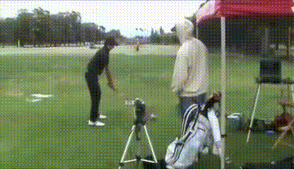
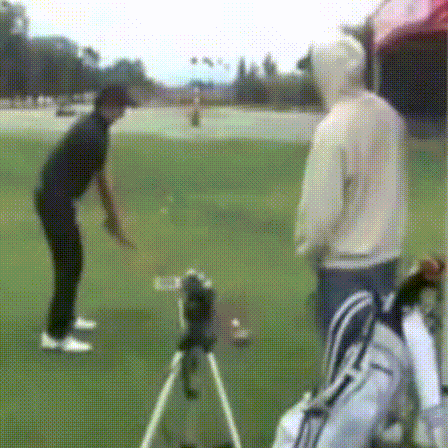

# RAte INvariance (RAIN) Layer Project Page

This project contains the code and results used for the rate invariance layer project. The main problem being tackled is the normalization of changes to temporal frequency of the input sections.

Our Goal: Submit ASAP

## Takeaways
* For Alpha only models
    * Best perfoming model is v23.2.1 (on both HMDB51 and HMDB51Rate). The activation function is sigmoid(relu(parameter)).
        * The parameter was initialized to a high value but eventually decreased to 0.5 and remained constant.
        * If the model is initialized and fixed at 0.5 performance is not sufficient to even beat baseline performance.
        * If model is initialized and fixed at a higher value (0.73) performance beats baseline but is not the highest possible.
        * Thus, the initialized learning period is important for these models to adjust their representation before saturating to a value of 0.5.
    * The 2nd best performing model is v23.4 (on both HMDB51 and HMDB51Rate). The activation function is exp(-relu(parameter)).
        * The alpha was initialized to 0.7788 when compared to v23. This forced it to saturate at 1.0 instead of 0.5.
    * The 3rd best performing model is v23.7.1 (on HMDB51). The activation function is tanh(relu(+-parameter))  * 0.5 + 0.5.
        * The only model where free roam on positive and negative sides of the parameter space was allowed and performance is so high. 

* For Phi only models
    * Best performing model is v 34.3.lstm (on both HMDB51 and HMDB51Rate). The activation function used is tanh(relu(+-parameter)) *0.5 + 0.5. 
        * The value of phi chosen is not by saturation and there is a steady learning process.
        * The layer is placed at the bottom.
    * 2nd best performing model is v31.3 (on both HMDB51 and HMDB51Rate). The activation function used is tanh(relu(+-parameter)) *0.5 + 0.5. 
        * The value of phi chosen is not by saturation and there is a steady learning process. 
        * The layer is placed at the top. 
    * One of the models uses an LSTM.
    * Both models do not use uniform sampling after phi is used.
    
* For Alpha + Phi models

## Table of Contents

* [Features to add to framework](#feattoadd)
* [Current Progress](#currentprogress)
* [Introduction](#intro)
* [Baseline Models](#baselinemodels)
* [RAIN Layers](#rainlayers)
    * [RAIN v23.2.1](#rainv23.2.1)
    * [RAIN v23.7.1](#rainv23.7.1)
    * [RAIN v24.0](#rainv24)
    * [RAIN v31.3](#rainv31.3)
    * [RAIN v34.3.lstm](#rainv34.3.lstm)
    * [RAIN v35.0](#rainv35)
    * [RAIN v36.0](#rainv36)
    * [RAIN v37.0](#rainv37)
    * [RAIN v38.0](#rainv38)
    * [RAIN v39.0](#rainv39)
    * [RAIN v40.0](#rainv40)

* [Experiment 1 - Models trained using original datasets](#expt1)
* [Experiment 2 - Models trained using rate-modified datasets](#expt2)
* [Ideas for RAIN Layer](#ideas)

<a name="feattoadd"/>
## Features to add to Framework
* Extraction of only layer weights after training and save them as data dictionaries.
* Option to load from data dictionaries (trained models using the framework) or initialize models.
* Adding TF records to speed up pipeline and make it consistent.
* Confirm LRCN compatibility to TF records.
* Adding TSN model and confirm performance.
* Adding optical flow models and confirming their performance.

<a name="currentprogress"/>
## Current Progress

     EXPERIMENT 1: Trained using original datasets
| Experiments           |  Coding in Progress  | Executing |  Debug  | Complete  (HMDB51)| Complete  (UCF101)|    
|:---------------------:|:--------------------:|:---------:|:-------:|:-----------------:|:-----------------:|
| VGG16                 |         &#9745;      |  &#9974;  | &#9974; |     &#9974;       |     &#9974;       |
| ResNet-50             |         &#9745;      |  &#9745;  | &#9745; |     &#9745;       |     &#9974;       |
| ResNet-50 + RAINv23.2.1 |    &#9745;      |  &#9745;  | &#9745; |     &#9745;       |     &#9974;       |
| ResNet-50 + RAINv23.4 |         &#9745;      |  &#9745;  | &#9745; |     &#9745;       |     &#9974;       |
| ResNet-50 + RAINv23.7.1 |         &#9745;      |  &#9745;  | &#9745; |     &#9745;       |     &#9974;       |
| ResNet-50 + RAINv31.3 |         &#9745;      |  &#9745;  | &#9745; |     &#9745;       |     &#9974;       |
| ResNet-50 + RAINv34.3.lstm |         &#9745;      |  &#9745;  | &#9745; |     &#9745;       |     &#9974;       |
| ResNet-50 + RAINv35.0 |         &#9745;      |  &#9745;  | &#9745; |    &#9974;       |     &#9974;       |

     EXPERIMENT 2: Trained using rate-modified datasets
| Experiments        |  Coding in Progress  | Executing |  Debug  | Complete (HMDB51) | Complete (UCF101) |
|:------------------:|:--------------------:|:---------:|:-------:|:-----------------:|:-----------------:|
| VGG16              |         &#9745;      |  &#9974;  | &#9974; |       &#9974;     |       &#9974;     |
| ResNet-50          |         &#9745;      |  &#9974;  | &#9974; |       &#9974;     |       &#9974;     |
| ResNet-50 + RAINv1 |         &#9745;      |  &#9974;  | &#9974; |       &#9974;     |       &#9974;     |

#### LEGEND
Complete   -  &#9745;
Incomplete -  &#9974;

<a name="intro"/>
## Introduction
**Problem**: Parameterzing temporal activity and extracting rate invariant features.

**Model**: end-to-end gradient based learning models (Neural Network), supervision using only action labels.

**Assumptions**

* Action: A set of body poses confined to a temporal order.
* Action Video: Single or multiple instances of an action within a video.
* Atmost, an action can take up the entire video (a complete single cycle over the entire set of datapoints).
* Frames per sec is consistent throughout all the videos in a dataset.
* Model revolves around the template formed by Spatial Transformer Networks(https://arxiv.org/abs/1506.02025).
* Assigning `soft` structure to extract necessary parameters, no intermediate or external supervision provided.

**Innovations**

* Differentiable, plug-n-play module which can be placed anywhere within a network where 1 independent dimension of the input is temporal.
* `Rate-normalized` outcome of the layer is fixed in size. Hence overcomes LSTM cell **memory issues** and allows **large videos to be applied to standard deep architectures in normal GPUs**.
* Custom layer definition for parameter extraction.
* Methodical demonstration of necessity to mathematically model rate-invariant characteristics in ANNs.

**Training data**: vanilla HMDB51 and UCF101 along with their rate modified verisons, with action labels.

**Testing data**: vanilla HMDB51 and UCF101 along with their rate modified versions.

**Applications**

* Improving action recognition, first person video etc.
* A plug-and-play layer to obtain normalized video representation.
* Application of the normalized representation to action segmentation, detection, etc.

<a name="baselinemodels"/>
## Baseline Models
* [ResNet50 + LSTM]:(https://github.com/fchollet/deep-learning-models/releases/download/v0.2/resnet50_weights_tf_dim_ordering_tf_kernels_notop.h5)
* [LRCN]           :()     
* [VGG16    + LSTM]:(https://github.com/fchollet/deep-learning-models/releases/download/v0.1/vgg16_weights_tf_dim_ordering_tf_kernels_notop.h5)

<a name="rainlayers"/>
## RAIN Layers
This section contains the implemented ideas for various versions of RAIN layers and their descriptions.  The versions begin at v21 because versions 1-20 used an different parameterization network that was deemed inferior to the current method.  The previous method incorporated the parameterization network directly into the model attempting to learn alpha and phi through multiple convolutional and fully connected layers before passing them into the extraction layer. Versions 21 and onward instead simply initialize variables alpha and phi and allow them to learn through backpropagation.  This new method causes a single alpha and phi value to be learned for every video.  This is addressed by incorporating an LSTM to process the input videos and learning alpha and phi from the hidden states of this LSTM. This LSTM formulation for the parameterization network will be implemented once various extraction layer versions have been tested and optimized. 

### RAIN Layers incorporating alpha and phi
----------------------------------------------

The use of sampling and phase offset akin to 1D signals should be sufficient to characterize a given action signal. Initialize alpha and phi as variables and let them learn based solely off of backpropagation. Inputs to extraction layer come from the beginning of the model directly from the input videos.

<a name="rainv35"/>
#### RAIN Layer v35
---------------
The best models using alpha only and phi only are combined. Alpha is defined at the beginning of the model and its' activation function is sigmoid(relu(parameter)). Phi is defined at the end of the model using an lstm and it's activation function is tanh(relu(+-parameter))  * 0.5 + 0.5.

![RAINv35 Paramnw PLACEHOLDER] (/images/Paramnw.pdf)
![RAINv35 extractlayer PLACEHOLDER] (/images/extractlayer.pdf)

<a name="rainv36"/>
#### RAIN Layer v36
---------------
Alpha is defined at the beginning of the model and its' activation function is exp(-relu(parameter)). Phi is defined at the end of the model using an lstm and its' activation function is tanh(relu(+-parameter))  * 0.5 + 0.5.

![RAINv36 Paramnw PLACEHOLDER] (/images/Paramnw.pdf)
![RAINv36 extractlayer PLACEHOLDER] (/images/extractlayer.pdf)

<a name="rainv37"/>
#### RAIN Layer v37
---------------
Alpha is defined at the beginning of the model and its' activation function is sigmoid(relu(parameter)). Phi is defined at the end of the model using an lstm and its' activation function is tanh(relu(+-parameter))  * 0.5 + 0.5.

![RAINv37 Paramnw PLACEHOLDER] (/images/Paramnw.pdf)
![RAINv37 extractlayer PLACEHOLDER] (/images/extractlayer.pdf)

<a name="rainv38"/>
#### RAIN Layer v38
---------------
Alpha is defined at the beginning of the model and its' activation function is  tanh(relu(+-parameter))  * 0.5 + 0.5. Phi is defined at the beginnning of the model without an lstm and its' activation function is tanh(relu(+-parameter))  * 0.5 + 0.5.

![RAINv38 Paramnw PLACEHOLDER] (/images/Paramnw.pdf)
![RAINv38 extractlayer PLACEHOLDER] (/images/extractlayer.pdf)

<a name="rainv39"/>
#### RAIN Layer v39
---------------
Alpha is defined at the beginning of the model and its' activation function is exp(-relu(parameter)). Phi is defined at the beginnning of the model without an lstm and its' activation function is tanh(relu(+-parameter))  * 0.5 + 0.5.

![RAINv39 Paramnw PLACEHOLDER] (/images/Paramnw.pdf)
![RAINv39 extractlayer PLACEHOLDER] (/images/extractlayer.pdf)

<a name="rainv40"/>
#### RAIN Layer v40
---------------
Alpha is defined at the beginning of the model and its' activation function is  tanh(relu(+-parameter))  * 0.5 + 0.5. Phi is defined at the beginnning of the model without an lstm and its' activation function is tanh(relu(+-parameter))  * 0.5 + 0.5.

![RAINv40 Paramnw PLACEHOLDER] (/images/Paramnw.pdf)
![RAINv40 extractlayer PLACEHOLDER] (/images/extractlayer.pdf)

### RAIN Layers incorporating alpha only
-----------------------------------------
<a name="rainv23.2.1"/>
#### RAIN Layer v23.2.1
---------------
Initialize alpha as a variable and let it learn based solely off of backpropagation. Inputs to extraction layer come from the beginning of the model. We are using only alpha in order to understand if uniform sampling over the entire sequence is important. If retaining some information about the entire setup is necessary then why not remove the offset parameter and instead attempt to interpolate using sampling parameter only. In case the sampling parameter minimizes to uniform sampling then we have a strong case to retain it.
We pass alpha through an ReLu activation before passing it through a sigmoid function. Reducing the parameter space that alpha has to choose from could allow it to learn a value other than 0 or 1 more easily.

![RAINv23.2.1 Paramnw PLACEHOLDER] (/images/Paramnw.pdf)
![RAINv23.2.1 extractlayer PLACEHOLDER] (/images/extractlayer.pdf)

<a name="rainv23.4"/>
#### RAIN Layer v23.4
---------------
Determine the impact of raising the initialization of alpha. The activation used is the ReLu function with a negative exponential function.

![RAINv23.4 Paramnw PLACEHOLDER] (/images/Paramnw.pdf)
![RAINv23.4 extractlayer PLACEHOLDER] (/images/extractlayer.pdf)

<a name="rainv23.7.1"/>
#### RAIN Layer v23.7.1
---------------
Tanh activation used with an internal relu activation function. Since relu forces the removal of negative parameters, we have included a condition that changes negative values to positive so that they are not negated by the relu activation.

![RAINv23.7.1 Paramnw PLACEHOLDER] (/images/Paramnw.pdf)
![RAINv23.7.1 extractlayer PLACEHOLDER] (/images/extractlayer.pdf)

### RAIN Layers incorporating phi only
---------------------------------------

<a name="rainv31.3"/>
#### RAIN Layer v31.3
---------------
Initialize phi at the beginning of the model and then extract the next L (50) frames starting at phi. Phi is a variable with a negative exponential activation function.

![RAINv31.3 Paramnw PLACEHOLDER] (/images/Paramnw.pdf)
![RAINv31.3 extractlayer PLACEHOLDER] (/images/extractlayer.pdf)

<a name="rainv34.3.lstm"/>
#### RAIN Layer v34.3.lstm
---------------
Initialize phi at the end of the model and then extract the next L (50) frames starting at phi. Phi is a variable with a negative exponential activation function.

![RAINv34.3.lstm Paramnw PLACEHOLDER] (/images/Paramnw.pdf)
![RAINv34.3.lstm extractlayer PLACEHOLDER] (/images/extractlayer.pdf)

<a name="expt1"/>
Experiment 1:  Models trained using original datasets
========================================================
The first experiment lists the results of models trained using only the original datasets.

<a name="paramsexpt1"/>
Parameters
----------
1. HMDB51 (For ResNet50 + LSTM and VGG16 + LSTM)
    * lr - 0.001   
    * momentum - 0.9   
    * wd - 0.001     
    * inputDims - 50 (250 for RAIN layers)
    * seqLength - 50    
    * outputDims - 51      
    * numVids - 3570    
    * size - 224        
    * nEpochs - 30    
    * saveFreq - 1      
    * valFreq - 3    
    * split - 1              
    * preprocessing:   
        * reduce framerate from 30 to 25 fps
        * resize to 256
        * random crop to 224
        * random flip
        * mean subtraction (R - 123.68, G - 116.778, B - 103.94)
        * extract 125 frame (loop if necessary) using offset
        * sample 25 from those 125
        * pad with 25 frames of zero

2. UCF 101 (For ResNet50 + LSTM and VGG16 + LSTM)
    * lr - 0.001   
    * momentum - 0.9   
    * wd - 0.001     
    * inputDims - 50     
    * seqLength - 50    
    * outputDims - 101      
    * numVids - 9537    
    * size - 224        
    * nEpochs - 30    
    * saveFreq - 1      
    * valFreq - 3    
    * split - 1              
    * preprocessing:   
        * resize to 256
        * random crop to 224
        * random flip
        * mean subtraction (R - 123.68, G - 116.778, B - 103.94)
        * extract 125 frame (loop if necessary) using offset
        * sample 25 from those 125
        * pad with 25 frames of zero

<a name="progressexpt1"/>
Progress
--------
    HMDB51 Baseline Experiments
|       Experiments        | Mean Recog. Accuracy(MRA) on Orig.  | Mean Recog. Accuracy(MRA) on Rate Modified  | Rate Bin 1 Accuracy (Slow Down) | Rate Bin 2 Accuracy (Slow Down) | Rate Bin 3 Accuracy (Speed Up) | Rate Bin 4 Accuracy (Speed Up) | Mean Variance of Intra Class Recognition Accuracies (ICRA) | Mean Difference of ICRA |
|:------------------------:|:----------------------------------: |:------------------------------------------: |:-------------------------------:|:-------------------------------:|:------------------------------:|:------------------------------:|:----------------------------------------------------------:|:-----------------------:|
|   VGG16 + LSTM           |              --.--%                 |                  --.--%                     |             --.--%              |             --.--%              |             --.--%             |             --.--%             |                              -.-                           |            -.-          |          
| ResNet50 + LSTM          |              43.01%                 |                  41.33%                     |           **41.38%**            |           **41.49%**            |           **41.35%**           |             41.11%             |                             3.21%                          |           8.26%         |          

    HMDB51 Original RAIN Layer Experiments
|    Alpha and Phi Experiments        |      Extract Layer MRA        |    Alpha Value   |    Phi Value   |     Rate Modified Dataset MRA     | Rate Bin 1 Accuracy (Slow Down) | Rate Bin 2 Accuracy (Slow Down) | Rate Bin 3 Accuracy (Speed Up) | Rate Bin 4 Accuracy (Speed Up) | Mean Variance of ICRA | Mean Difference of ICRA |
|:-----------------------------------:|:----------------------------: |:---------------: |:-------------: |:--------------------------------: |:-------------------------------:|:-------------------------------:|:------------------------------:|:------------------------------:|:---------------------:|:-----------------------:|
| ResNet50 + RAINv35.lstm + LSTM      |              --.--%           |        -.--      |      -.--      |                --.--%             |             --.--%              |             --.--%              |             --.--%             |             --.--%             |           -.-         |           -.-           |
| ResNet50 + RAINv36.lstm + LSTM      |              --.--%         |        -.--      |      -.--      |                --.--%             |             --.--%              |             --.--%              |             --.--%             |             --.--%             |           -.-         |           -.-           |
| ResNet50 + RAINv37.lstm + LSTM      |              --.--%         |        -.--      |      -.--      |                --.--%             |             --.--%              |             --.--%              |             --.--%             |             --.--%             |           -.-         |           -.-           |
| ResNet50 + RAINv38 + LSTM           |            **44.25**%         |        -.--      |      -.--      |                --.--%             |             --.--%              |             --.--%              |             --.--%             |             --.--%             |           -.-         |           -.-           |
| ResNet50 + RAINv39 + LSTM           |              41.83%           |        -.--      |      -.--      |                --.--%             |             --.--%              |             --.--%              |             --.--%             |             --.--%             |           -.-         |           -.-           |
| ResNet50 + RAINv40 + LSTM           |              41.83%           |        -.--      |      -.--      |                --.--%             |             --.--%              |             --.--%              |             --.--%             |             --.--%             |           -.-         |           -.-           |
| | | | |
|    Alpha Only Experiments           |      Extract Layer MRA        |    Alpha Value   |    Phi Value   |     Rate Modified Dataset MRA     | Rate Bin 1 Accuracy (Slow Down) | Rate Bin 2 Accuracy (Slow Down) | Rate Bin 3 Accuracy (Speed Up) | Rate Bin 4 Accuracy (Speed Up) | Mean Variance of ICRA | Mean Difference of ICRA |
| ResNet50 + RAINv23.2.1 + LSTM       |             **46.01**%        |        0.50      |      N/A       |            **44.41**%             |           **44.44%**            |             44.09%              |           **44.87%**           |             44.25%             |          3.37%        |           8.61%         |
| ResNet50 + RAINv23.4 + LSTM         |             **45.62**%        |        1.0       |      N/A       |            **44.29**%             |             44.17%              |             43.70%              |           **45.18%**           |             44.10%             |          2.94%        |           7.62%         |
| ResNet50 + RAINv23.7.1 + LSTM       |             **44.77**%        |        0.83      |      N/A       |            **43.33**%             |           **44.30%**            |           **43.47%**            |           **43.49%**           |             42.05%             |          3.66%        |           9.29%         |
| | | | |
|    Phi Only Experiments             |      Extract Layer MRA        |    Alpha Value   |   Phi Value    |     Rate Modified Dataset MRA     | Rate Bin 1 Accuracy (Slow Down) | Rate Bin 2 Accuracy (Slow Down) | Rate Bin 3 Accuracy (Speed Up) | Rate Bin 4 Accuracy (Speed Up) | Mean Variance of ICRA | Mean Difference of ICRA |
| ResNet50 + RAINv31.3 + LSTM         |             **44.25**%        |        N/A       |      0.97      |            **42.82**%             |             41.36%              |             42.32%              |           **44.82%**           |             42.79%             |          3.88%        |           9.85%         |
| ResNet50 + RAINv34.3.lstm + LSTM    |             **44.71**%        |        N/A       |    > 0.94      |            **42.89**%             |             40.86%              |             42.37%              |           **44.32%**           |           **43.99%**           |          3.89%        |           10.26%        |

*-models denoted with a star were not trained to completion due to having already learned either one or zero for phi and alpha.
Bold Rate Bins - That bin had a higher accuracy than the total rate modified dataset

    UCF101 Experiments
|       Experiments        | Mean Recog. Accuracy(MRA) on Orig.  | Mean Recog. Accuracy(MRA) on Rate Modified  |
|:------------------------:|:----------------------------------: |:------------------------------------------: |
|   VGG16 + LSTM           |              --.--%                 |                  --.--%                     |
| ResNet50 + LSTM          |              --.--%                 |                  --.--%                     |

    UCF101 Original RAIN Layer Experiments
|       Experiments        | Median of Extract Layer MRA  | Mean of Extract Layer MRA  | Max of Extract Layer MRA  |
|:------------------------:|:---------------------------: |:-------------------------: |:------------------------: |
| ResNet50 + RAINv1 + LSTM |             --.--%           |             --.--%         |          --.--%           |

### Experiment 1 NOTES:

#### Example Gifs

#### Original Video

    
This gif is the original video in the HMDB51 dataset.

#### Baseline Preprocessed Example

The above gif shows the video afer undergoing the standard preprocessing. This preprocessing consists of cropping the video and looping it starting at an offset until it reaches 250 frames.  

The above video is the preprocessing undergone for the baseline which includes our standard preprocessing and then uniform sampling down to 50 frames.  The uniform sampling causes an apparent five times speed up of the video. 

Every RAIN model we use recieves the original datasets video looped to 250 frames as input to the RAIN layer.

#### RAIN v23.2.1

Output: alpha = 0.5

The video below on the left is the input to the RAIN layer and the right is the output.
The output video contains the first half of the input video uniformly sampled down to L (50) frames.

#### RAIN v23.4

Output: alpha = 1.0 

The video below on the left is the input to the RAIN layer and the right is the output.
The output video is a uniformly sampled version of the entire input video.

Since alpha = 1.0 reduces 

#### RAIN v23.7.1

Output: alpha = 0.83

The video below on the left is the input to the RAIN layer and the right is the output.
The output video is the first 83% of the input video uniformly sampled down to L (50) frames.

#### RAIN v31.3

Output: phi = 0.97

The video below on the left is the input to the RAIN layer and the right is the output.
The output video begins at the frame 0.97*(N-L) and takes the next L (50) consecutive frames. In this case N=250 and L=50.

#### RAIN v34.3.lstm

Output: phi > 0.94

When phi = 0.94, the output video begins at the frame 0.94*(N-L) and takes the next L (50) consecutive frames. However, since an LSTM is incorporated the value of phi will vary from video to video ranging from 0.94 to 0.99.  
In this case N=100 and L=50.

The video below on the left is the input to the RAIN layer and the right is the output.
In the output video phi=0.99 which is nearly the last 50 frames.

phi = 0.9469 in the example gif below. The right video is the output of the RAIN layer given the left video as input. The output is composed of 50 consecutive frames of the input video starting at the frame 94.69% of the way from frame 0 to (N-L), in this case (100-50), of the input video.

<a name="expt2"/>
Experiment 2:  Models trained using rate-modified datasets
========================================================
The second experiment lists the results of models trained using only the rate-modified datasets.

<a name="paramsexpt2"/>
Parameters
----------
1. HMDB51 (For ResNet50 + LSTM and VGG16 + LSTM)
    * lr - 0.001  
    * momentum - 0.9
    * wd - 0.001  
    * inputDims - 50    
    * seqLength - 50
    * outputDims - 51  
    * numVids - 35700
    * size - 224        
    * nEpochs - 5
    * saveFreq - 1  
    * valFreq - 3
    * split - 1     
    * preprocessing:   
        * reduce framerate from 30 to 25 fps
        * resize to 256
        * random crop to 224
        * random flip, mean subtraction (R - 123.68, G - 116.778, B - 103.94)
        * extract 125 frame (loop if necessary) using offset
        * sample 25 from those 125
        * pad with 25 frames of zero

2. UCF 101 (For ResNet50 + LSTM and VGG16 + LSTM)
    * lr - 0.001   
    * momentum - 0.9  
    * wd - 0.001  
    * inputDims - 50     
    * seqLength - 50    
    * outputDims - 101
    * numVids - 95370
    * size - 224    
    * nEpochs - 1
    * saveFreq - 1
    * valFreq - 3
    * split - 1
    * preprocessing:   
        * resize to 256
        * random crop to 224
        * random flip
        * mean subtraction (R - 123.68, G - 116.778, B - 103.94),  
        * extract 125 frame (loop if necessary) using offset
        * sample 25 from those 125
        * pad with 25 frames of zero

<a name="progressexpt2"/>
Progress
--------
    HMDB51 Experiments
|       Experiments        | Mean Recog. Accuracy(MRA) on Orig.  | Mean Recog. Accuracy(MRA) on Rate Modified  |
|:------------------------:|:----------------------------------: |:------------------------------------------: |
|   VGG16 + LSTM           |              --.--%                 |                  --.--%                     |
| ResNet50 + LSTM          |              --.--%                 |                  --.--%                     |
| ResNet50 + RAINv1 + LSTM |              --.--%                 |                  --.--%                     |

    UCF101 Experiments
|       Experiments        | Mean Recog. Accuracy(MRA) on Orig.  | Mean Recog. Accuracy(MRA) on Rate Modified  |
|:------------------------:|:----------------------------------: |:------------------------------------------: |
|   VGG16 + LSTM           |              --.--%                 |                  --.--%                     |
| ResNet50 + LSTM          |              --.--%                 |                  --.--%                     |
| ResNet50 + RAINv1 + LSTM |              --.--%                 |                  --.--%                     |

![Ex1:baselineSpeedup] (/images/resnet_UCF101Rate_vid23002_input.gif/)

### NOTES:

<a name="ideas"/>
Ideas for Future Versions of RAIN Layer
===================
* V1:
    * Current implementation using offset and sampling parameters
    * Mean of Extract Layer
    * Median of Extract Layer
    * Max of Extract Layer
* V2:
    * Idea: (alpha only) The immediate next idea we were thinking about was to understand if uniform sampling over the entire sequence is important. If retaining some information about the entire setup is necessary then why not remove the offset parameter and instead attempt to interpolate using sampling parameter only. In case the sampling parameter minimizes to uniform sampling then we have a strong case to retain it.
    * Mean of Extract Layer
    * Median of Extract Layer
    * Max of Extract Layer
* V3:
    * Idea: (phi only) Similarly to V2, the idea behind this version to remove the sampling parameter and retain the offset parameter. The sampling will be uniform. This will show the impact that splicing the input video based off of the offset parameter.
    * Mean of Extract Layer
    * Median of Extract Layer
    * Max of Extract Layer
* V4:
    * Idea: (direct indices) Another idea proposed was to extract indices directly from the parameterization network and use them to interpolate output of extract layer. An interesting case would be the ordering proposed by such a system, or rather the lack of ordering so to speak. Are we getting close to segmentation territory possibly ?
    * Non-Sorted output of Extract Layer
    * Sorted output of Extract Layer
* V5:
    * Idea: (phi start, phi end) Replace the sampling parameter with a second offset parameter indicating the end frame of the sampling region. L frames will then be uniformly sampled between the start offset parameter and end offset parameter.
    * Mean of Extract Layer
    * Median of Extract Layer
    * Max of Extract Layer
* V6:
    * Idea: (nonlinear rate transform) Allow the output of the extract layer to be parameters used to modify the input video by gradually slowing down the video from the default rate to some learned rate until it reaches the main action and then speeding it back up to the default rate. The beginning and end points of this sampling will still be the beginning and end of the input video.
    * Variables learned directly

* V6.1:
    * Idea: (v6, alpha intiialized to sigmoid(1.0) phi initialized to sigmoid(1.0)) The original v6 model may have had a poor initialization for learning alpha and phi so they will both be reinitialized to sigmoid(1.0) and trained again.
    * Variables learned directly
    
* V7:
    * Idea: (Increase L) When comparing the inputs to the baseline networks, we found that multiple quick cycles are provided as input to the baseline networks. Given this high amount of redundancy, a possible solution to our situation of capturing only a single cycle would be to increase L so that the network has a longer timeframe to look over and make a decision.
    * Mean of Extract Layer
    * Median of Extract Layer
    * Max of Extract Layer
* V8:
    * Idea: (Change activation of FC2 to ReLu) While observing the outcomes of V1 we found that the videos have a general tendency to get slowed down but rarely speed up. This enforces a scenario where the rates of RAIN output videos are not the same. This could possibly be due to shackling of alpha by sigmoid activation (although this still allows for a theoretic speed up). Instead we believe ReLu might be a possible solution to this issue.
    * Mean of Extract Layer
    * Median of Extract Layer
    * Max of Extract Layer
* V9:
    * Idea: (V7 + V8) The previous versions seeks to study the individual impacts of each suggested change while this version seeks to combine them.
    * Mean of Extract Layer
    * Median of Extract Layer
    * Max of Extract Layer
* V10:
    * Idea: (V2 + phi after sampling) Based off of v2 results, we found that it is benenficial to allow alpha to sample from the entire video. Only afterwards will we apply the offset to the clip that was sampled by alpha. We will then resample that output to the correct number of frames, L.
    * Mean of Extract Layer
    * Median of Extract Layer
    * Max of Extract Layer

* V11:
    * Idea: (V3 + ReLu) Seeing that v3 fluctuates the learned value of phi from zero to one, it may be possible to apply a relu activation to fc2 instead of the sigmoid which can bias the values to zero or one.
    * Median of Extract Layer

* V12:
    * Idea: (V3 + random initializations) Currently the convolutional layers in the parameterization network are initialized to pretrained resnet weights, this may be what causes the network to bias the values of 0 and 1 for phi.
    * Median of Extract Layer

* V12.1:
    * Idea: (V12 + ReLu after Conv1 in Parameterization Network) Add an ReLu activation after Conv1 in the parameterization network.
    * Median of Extract Layer

* V13:
    * Idea: (V3 + LSTM) The network may not be able to learn the temporal information of the input properly in its current state which could be improved upon with an LSTM.
    * Median of Extract Layer

* V14:
    * Idea: (Alternate V1) The v1 definition of the RAIN layer causes the output video to return the first frame of the input if alpha equals zero no matter the value of phi. This model avoid this issue by first calculating alpha and then adding the offset. 
    * Median of Extract Layer

* V14.1:
    * Idea: (V14 without ReLu after Conv1 in Parameteriazation Network) Remove the ReLu after Conv1 to compare with v14.0 to determine the impact of the ReLu.
    * Median of Extract Layer

* V14.2:
    * Idea: (V14.1 with random initializations) Remove the parameterization network initializations to determine their impact.
    * Median of Extract Layer

* V14.3:
    * Idea: (V14.2 with FC1 linear activation) Remove the activation function on FC1 to determine its impact.
    * Median of Extract Layer
    
* V15:
    * Idea: (V14 ReLu activation for phi, sigmoid activation for alpha, random initializations) The value phi has a linear relationship with the chosen output indices while alphas relationship is nonlinear. Thus FC2 is split into FC2a for alpha with a sigmoid activation function and FC2b for phi with an ReLu activation function.
    * Median of Extract Layer
     
* V16:
    * Idea: (Add FC3 layer with V dims)  This model attempts to fix the issue that could arrise from combining dimension K and V immediately after the convolution layers by first passing dimension K through FC1 then reshaping the output and passing dimension V through FC2 before reducing the output to 2 dimensions in FC3.
    * Median of Extract Layer
     
* V17:
    * Idea: (Pass K dims through FC1 then reshape to V dims through FC2) The filter blocks relating to each pixel may contain the information needed to learn alpha and phi.  Allow output of FC2 to be the filter dimension, V, x 2. 
    * Median of Extract Layer
     
* V18:
    * Idea: (Parameterization Network at the end, phi and alpha) Since the parameterization network has been located at the top of the model, the gradients may have had less of an impact by the time they reached the parameterization network, resulting in alpha and phi just falling to 0.0 or 1.0.  Moving the parameterization network to the end could allow the gradients to have a greater impact on alpha and phi values. 
    * Mean of Extract Layer
    * Median of Extract Layer
 
* V19:
    * Idea: (V18 + negative exponent) The tanh used in v18 to force the values of alpha and phi may have been to abrupt causing them to fall to 0.0 or 1.0.  A negative exponent has a more gradual curve which could allow alpha and phi to learn values in between 0 and 1.
    * Median of Extract Layer

* V20:
    * Idea: (V18 phi only, take max of block softmax) Instead of allowing phi to be any frames, only allow it to choose from the J blocks.  
    * Max of Extract Layer

* V21:
    * Idea: (alpha and phi as variables, based off of v14) Initialize alpha and phi as variables and let them learn based solely off of backpropagation. Inputs to extraction layer come from the beginning of the model, similar to v14.
    * Variables learned directly

* V22:
    * Idea: (alpha and phi as variables, based off of v18) Initialize alpha and phi as variables and let them learn based solely off of backpropagation. Inputs to extraction layer come from the end of the model, similar to v18.
    * Variables learned directly

* V23:
    * Idea: (alpha as a variable, based off of v2 + v21) Initialize alpha as a variable and let it learn based solely off of backpropagation. Inputs to extraction layer come from the beginning of the model, similar to v2.
    * Variables learned directly
    
    * V23 LSTM:
        * Idea: (v23 Initialize alpha using an LSTM) Initialize alpha based off of the hidden state of an LSTM unrolled 4 times. LSTM location towards the beginning of the model.
        * Variables learned through LSTM
    
    * V23.1:
        * Idea: (v23 + tanh) ReLu with a negative exponential function causes any negative value to default to 1.0.  Switching the activation function to tanh will allow negative values to remain valid
        * Variables learned directly
        
        * V23.1.1:
            * Idea: (v23 + relu + tanh) Reducing the parameter space that alpha has to choose from could allow it to learn a value other than 0 or 1 more easily.
            * Variables learned directly
    
        * V23.1.2:
            * Idea: (v23 + -relu + tanh) v23.1.1 forces alpha to have values from 0.5 to 1.0, this method will allow alpha to have values from 0.0 to 0.5 to see if it still results in alpha=0.5.
            * Variables learned directly
    * V23.2:
        * Idea: (v23 + sigmoid) ReLu with a negative exponential function causes any negative value to default to 1.0.  Switching the activation function to sigmoid will allow negative values to remain valid
        * Variables learned directly
        
        * V23.2.1:
            * Idea: (v23 + relu + sigmoid) Reducing the parameter space that alpha has to choose from could allow it to learn a value other than 0 or 1 more easily.
            * Variables learned directly
    
            * V23.2.1.1:
                * Idea: (v23 + relu + sigmoid + alpha is constant initialzied to 0.73) Since the best performance is reached when alpha is held constant for the majority of training, this model will determine the impact of learning different initializations of the constant alpha.
                * Alpha is constant
    
            * V23.2.1.2:
                * Idea: (v23 + relu + sigmoid + alpha is constant initialzied to 0.50) Since the best performance is reached when alpha is held constant for the majority of training, this model will determine the impact of learning different initializations of the constant alpha.
                * Alpha is constant
    
        * V23.2.2:
            * Idea: (v23 + -relu + sigmoid) v23.2.1 forces alpha to have values from 0.5 to 1.0, this method will allow alpha to have values from 0.0 to 0.5 to see if it still results in alpha=0.5.
            * Variables learned directly
        
            * V23.2.2.1:
                * Idea: (v23 + -relu + sigmoid + alpha is constant initialzied to 0.27) Since the best performance is reached when alpha is held constant for the majority of training, this model will determine the impact of learning different initializations of the constant alpha.
                * Alpha is constant
    * V23.3:
        * Idea: (v23 + initialize alpha to 0.25) The model may be able to learn to not default to 1.0 is the initialization of alpha starts lower.
        * Variables learned directly
    
    * V23.4:
        * Idea: (v23 + initialize alpha to 0.779) Determine the impace of raising the initialization of alpha.
    
    * V23.5:
        * Idea: (v23 + initialize alpha to 0.173) Determine the impace of lowering the initialization of alpha.
        * Variables learned directly
        
    * V23.6:
        * Idea: (v23 + double exponential activation) The exponential activation used in v23 allows for a more gradual transition from zero to one than tanh or sigmoid, however using relu limits the values learned by the parameterization network to be poisitive otherwise all negative values get defaulted to alpha=1.0. Using another exponential function for negative values allows them to result in alpha values between zero and one as well.
        * Variables learned directly
        
    * V23.7:
        
        * V23.7.1:
            * Idea: (tanh(relu) * 0.5 + 0.5) Allowing both positive and negative values to have an impact in training and choice of alpha.
            * Variables learned directly
        * V23.7.2:
            * Idea: (tanh(-relu) * 0.5 + 0.5) Allowing both positive and negative values to have an impact in training and choice of alpha.
            * Variables learned directly
    * V23.8:
        
        * V23.8.1:
            * Idea: (sigmoid(relu)) Allowing both positive and negative values to have an impact in training and choice of alpha.
            * Variables learned directly
        * V23.8.2:
            * Idea: (sigmoid(-relu)) Allowing both positive and negative values to have an impact in training and choice of alpha.
            * Variables learned directly
            
    

* V24:
    * Idea: (alpha as a variable, based off of v2 + v22) Initialize alpha as a variable and let it learn based solely off of backpropagation. Inputs to extraction layer come from the end of the model, similar to v22.
    * Variables learned directly
    
    * V24 LSTM:
        * Idea: (v24 Initialize alpha using an LSTM) Initialize alpha based off of the hidden state of an LSTM unrolled 4 times. LSTM location is at the end of the model.
        * Variables learned through LSTM
        
    * V24.1:
        * Idea: (v24 + initial alpha = 0.25) The model may be able to learn to not default to 1.0 is the initialization of alpha starts lower.
        * Variables learned directly

* V25:
    * Idea: (phi as a variable, based off of v3 + v21) Initialize phi as a variable and let it learn based solely off of backpropagation. Inputs to extraction layer come from the beginning of the model, similar to v21.
    * Variables learned directly

* V26:
    * Idea: (phi as a variable, based off of v3 + v22) Initialize phi as a variable and let it learn based solely off of backpropagation. Inputs to extraction layer come from the end of the model, similar to v22.
    * Variables learned directly
     
* V27:
    * Idea: (2 Step - offset then alpha, beginning of model) Initialize phi and alpha and then let them learn solely off of backpropagation. First apply the offset phi, then sample alpha from the remaining frames.
    * Variables learned directly

* V28:
    * Idea: (2 Step - offset then alpha, end of model) Initialize phi and alpha and then let them learn solely off of backpropagation. First apply the offset phi, then sample alpha from the remaining frames.
    * Variables learned directly

* V29:
    * Idea: (Define alpha on top, then phi on bottom) Initialize alpha at the beginning of the model and sample the input video, then pass this through the network until the end where phi gets initialized and offsets the video and uniformly samples to L frames.
    * Variables learned directly

* V30:
    * Idea: (Define phi on top, then alpha on bottom) Initialize phi at the beginning of the model and offset the input video, then pass this through the network until the end where alpha gets initialized and samples the video to L frames.
    * Variables learned directly

* V31:
    * Idea: (Phi only, extract next 50 frames) Initialize phi at the beginning of the model and then extract the next L (50) frames starting at phi. Phi is a variable with a negative exponential activation function.
    * Variables learned directly

* V32:
    * Idea: (FM at the bottom) The idea is to use frequency modulation exactly like v6 except that it will be applied to the features at the bottom of the model.
    * Variables learned directly

* V33:
    * Idea: (Simplified FM) This formulation is similar to the other FM model except that alpha and phi dictate the location and rate of the input video that gets slowed down.  The output dimension of this slowed down section is L/2, where the other L/2 frames are the remaining beginning and end of the input video uniformly sampled.
    * Variables learned directly

* V34:
    * Idea: (Phi only, L only, end of model) Initialize phi at the end of the model and then extract the next L (50) frames starting at phi. Phi is a variable with a negative exponential activation function.
    * Variables learned directly

* Alternate:
    * Pass the parameters through an LSTM before entering the RAIN layer.
